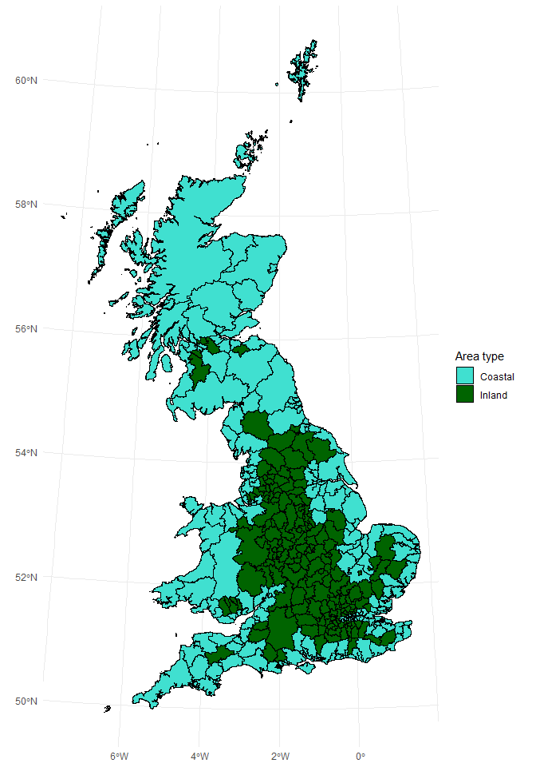

Code-along, Week 09: Modelling pubs, continued
================
Alex Homer
18 November 2021

This week’s data come from the UK’s [Office for National
Statistics](https://www.ons.gov.uk/) (ONS). We will be using the
following datasets:

-   [Public houses and bars by local
    authority](https://www.ons.gov.uk/businessindustryandtrade/business/activitysizeandlocation/datasets/publichousesandbarsbylocalauthority)
    (Copyright date: 2018)
-   [Estimates of the population for the UK, England and Wales, Scotland
    and Northern
    Ireland](https://www.ons.gov.uk/peoplepopulationandcommunity/populationandmigration/populationestimates/datasets/populationestimatesforukenglandandwalesscotlandandnorthernireland)
    (Copyright date: 2021)
-   [Earnings and hours worked, place of residence by local authority:
    ASHE Table
    8](https://www.ons.gov.uk/employmentandlabourmarket/peopleinwork/earningsandworkinghours/datasets/placeofresidencebylocalauthorityashetable8)
    (Copyright date: 2021)
-   [Standard Area Measurements (2018) for Administrative Areas in the
    United
    Kingdom](https://geoportal.statistics.gov.uk/datasets/standard-area-measurements-2018-for-administrative-areas-in-the-united-kingdom/about)
    (Copyright date: 2019)
-   [Life Expectancy by Local
    Authority](https://www.ons.gov.uk/datasets/life-expectancy-by-local-authority/editions/time-series/versions/1)
    (Copyright date: 2020)
-   [Local Authority Districts (December 2018) Boundaries UK
    BFC](https://geoportal.statistics.gov.uk/maps/fef73aeaf13c417dadf2fc99abcf8eef/about)
    (Copyright date: 2019)

The data are subject to crown copyright and database rights and are used
under the [Open Government Licence
v3.0](https://www.nationalarchives.gov.uk/doc/open-government-licence/version/3/).
In addition the boundary file contains OS data © Crown copyright and
database right 2019.

``` r
library(tidyverse)
library(tidymodels)
library(sf)
library(here)
```

## Read data

I’ve already done some of the cleanup and joining in advance to save
time in the live session. You can see the cleanup script in the “data”
folder of this repo.

``` r
pubs_data <- readRDS(here("data/pubs-final.rds"))
```

Because I put these data together, let’s write a data dictionary:

-   `area_code`: the [ONS area
    code](https://en.wikipedia.org/wiki/ONS_coding_system) for each
    district
-   `area_name`: the name of each district
-   `num_pubs`: the number of pubs in each district (2018)
-   `pop`: the population of each district (2018)
-   `pubs_per_capita`: the number of pubs per person (2018; obtained by
    dividing `num_pubs` by `pop`)
-   `country`: which UK nation each district belongs to (England,
    Northern Ireland, Scotland or Wales)
-   `median_pay_2017`: the median weekly pay, in pounds sterling, for
    residents of each district (2017)
-   `area_sqkm`: the area, in square kilometres, of each district to
    mean high water level
-   `coastal`: categorical variable, with three values:
    -   `"Inland"`, for districts in Great Britain whose total extent is
        equal to their extent to mean high water level
    -   `"Coastal"`, for districts in Great Britain whose total extent
        is greater than their extent to mean high water level
    -   `NA`, for districts in Northern Ireland (the data in NI appear
        to have been measured differently, so all districts have equal
        values for their total extent and extent to mean high water)
-   `pop_dens`: the population density (people per square kilometre) of
    each district (2018; obtained by dividing `pop` by `area_sqkm`)
-   `life_exp_female`, `life_exp_male`: the life expectancy at birth of
    people born in each district, broken down by binary sex (2016–2018)
    [1]

It’s worth noting that the `coastal` variable doesn’t necessarily agree
with intuitive definitions of the words “coastal” and “inland”, because
of the effect of tidal rivers on the data…

``` r
shape_data <- read_sf(
  here(
    "data/map/Local_Authority_Districts_(December_2018)_Boundaries_UK_BFC.shp"
  )
)

shape_data %>%
  rename(area_code = lad18cd) %>%
  left_join(pubs_data, by = "area_code") %>%
  filter(!str_detect(area_code, "^N")) %>%
  ggplot(aes(fill = coastal)) +
  geom_sf(colour = "black") +
  scale_fill_manual(values = c(Coastal = "turquoise", Inland = "darkGreen")) +
  labs(fill = "Area type") +
  theme_minimal()
```

<!-- -->

## EDA

``` r
glimpse(pubs_data)
```

    ## Rows: 391
    ## Columns: 12
    ## $ area_code       <chr> "E06000047", "E06000005", "E06000001", "E06000002", "E~
    ## $ area_name       <chr> "County Durham", "Darlington", "Hartlepool", "Middlesb~
    ## $ num_pubs        <dbl> 325, 70, 50, 65, 245, 85, 110, 120, 195, 105, 100, 145~
    ## $ pop             <dbl> 526980, 106566, 93242, 140545, 320274, 136718, 197213,~
    ## $ pubs_per_capita <dbl> 0.0006167217, 0.0006568699, 0.0005362390, 0.0004624853~
    ## $ country         <chr> "England", "England", "England", "England", "England",~
    ## $ median_pay_2017 <dbl> 439.0, 416.2, 431.6, 364.3, 413.2, 387.6, 435.7, 405.5~
    ## $ area_sqkm       <dbl> 2231.5422, 197.4758, 93.5595, 53.8888, 5026.2114, 244.~
    ## $ coastal         <chr> "Coastal", "Inland", "Coastal", "Coastal", "Coastal", ~
    ## $ pop_dens        <dbl> 236.15059, 539.64081, 996.60644, 2608.05585, 63.72076,~
    ## $ life_exp_female <dbl> 81.46, 82.39, 81.33, 80.02, 82.71, 81.78, 81.41, 81.43~
    ## $ life_exp_male   <dbl> 78.24, 78.72, 76.82, 75.27, 79.40, 77.99, 78.14, 77.46~

We’re now going to assess the data!

[1] Sex and gender are, of course, more complicated than that, but the
ONS only gives “male” and “female” figures; in the UK all birth
certificates have one of these two options recorded.
